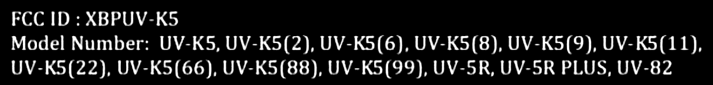
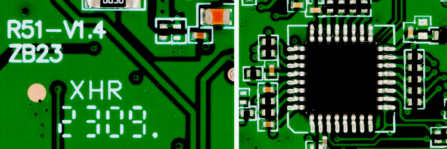
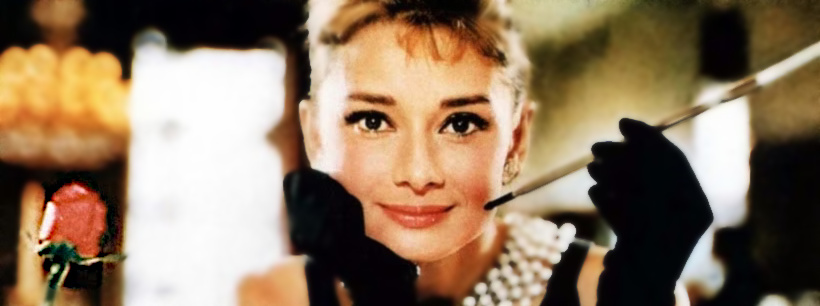

## UV-K5 experimental firmware

**Open Source re-implementation originally forked from Quansheng firmware v2.1.27**

> [!WARNING]
>
> This repository contains **UNTESTED** code and only `experimental` is actively [developed](https://github.com/robang74/uv-k5-firmware-custom/graphs/commit-activity).

The root `README.md` has been moved in `docs/` folder, here:

* [docs/README.md](docs/README.md)

The original wiki has been revisited and it is available here:

* [wiki](wiki) welcome page

* custom firmware [manual](wiki/custom-firmware-manual.pdf) (PDF)

* spectrum analyzer [guide](wiki/spectrum-analyzer-guide.pdf) (PDF)

This home page is dedicated to the `robang74` fork and its development.

Discussions [forum is open](https://github.com/robang74/uv-k5-firmware-custom/discussions/2), feel free to use it or alternatively write to [me](mailto:roberto.foglietta@gmail.com).

</br>

## UV-K5 family hardware

Quansheng UV-K5 is a name and a shell that contains an electronic PCB which is the same among various models (cfr. [here](docs/UV-K5.pdf)) included the UV-5R but compated with this, the UV-K5 can be modded also in terms of firmware.

<div align="center">



</div>

Its microprocessor is an ARM Cortex M0/+, a Chinese clone of STM32G030K8T6 (M0+, 8Kb SRAM) or a STM32F030K8T6 (M0, 16kb SRAM). With the uP core which works at 64MHz and all the stuff aroud (but not the EEPROM) packaged with 32-pinout case (LQFP32, 7x7 mm). This chip contains 64Kb of program memory space (internal flash) and the RAM and the RF (radio frequency) chip is a BK4819 while the the 64Kb EEPROM is soldered as external component on the same PCB.

Therefore, it allows 60Kb firmware files reasonably because the first 4Kb are used for the bootloader which also deliver the firmware update from the serial port embedded into the hearphone/mic jacks.

The BK4819 is a half duplex TDD FM transceiver operating within 18 MHz ~ 660, MHz, 840 MHz ~1300 MHz band range. Besides speech communication, the BK4819 on-chip FSK data modem supports F2D and F1W emission to be used in both FRS and DPMR band for text message and GPS information exchange. 

<div align="center">



</div>

The following branded STM32G031, STM32G041 Cortex G-series are two models providing the electrical pinout compatible with the STM32G030x8. Moreover, a quick investigation these two model are provided with a RAM that can vary between 8Kb upto 64Kb.

- The STM32G031 is similar to the STM32G030, but with some additional features such as ADC peripheral enhancements and power management functions.

- Compatible in terms of pinout with STM32G031, with hardware security function that can support encryption.

At this time, the compatibility with other uP chips is under investigation. The final word can be a chip upgrade that works.

</br>

## Fork status

The branch's git status says N commits behind `armel/main` but changes are cherry picked, also from other [contributors](https://github.com/robang74/uv-k5-firmware-custom/graphs/contributors). The pending cherry-pick from the `armel` repository among others janitory and developing activities are usually liste in [TODO](TODO) file.

</br>

## Fork goal

The goal is to include as much features as possible and in order to achieve this result, the size of the firmware should be shrinked a lot.

There are several ways to operate on this aim:

1. data management: `bool` is `uint8_t`, `struct` and `union` bloat, alignement vs packaging, etc.

2. memory usage: (un)initialised `static` or `global` variables waste space useful for coding, etc.

3. external components reduction size like [printf](https://github.com/robang74/uv-k5-firmware-custom/tree/experimental/external/printf) that has been limited to this project needs

5. function stack: variables used by functions a tricking because uP align them at 32 bits.

6. data encoding: those data which are required can be encoded in a more size-efficient manner.

On the `experimental` branch has been used several technics to shrink the firmware size as listed above.

The *working-in-progress* `RUNDATA` approach is quite interesting and allowed to include many features.

</br>

## Fork size

The following data have been collected and can be replicated by tag [data06](https://github.com/robang74/uv-k5-firmware-custom/releases/tag/data06):

```
# no torch & no charge lvl, need  (bytes)  (*next)  (rundata)  (printf)  (EN/CH)
# REDUCE_LOW_MID_TX_POWER     0b  (incl.)     *         *       (   0)      =
# FLASHLIGHT                 64b  (avail)     *         *       (  52)      =
# SHOW_CHARGE_LEVEL         104b  (avail)     *         *       (  84)      =
# F4HWN_RX_TX_TIMER         148b  (avail)  ( -128)      *       ( 152)      =
# COPY_CHAN_TO_VFO          192b  (incl.)     *         *       ( 116)      =
# AUDIO_BAR                 386b  ( -184)     x         *       ( 400)      =
# FEAT_F4HWN_SLEEP          512b  ( -440)     x         *       ( 452)      =
# VOX                             (-1032)     x      (avail)    ( 968)      =
# AIRCOPY                         (-1996)     x      (-1028)    (1960)      =
# ------------------------------------------------------------------------------
# ALL THE OPTIONS                 (-3900)     ?         ?
#                                                                       
# VOICE ENGLIHSH ONLY (new code)     ?        x         x                 ( 476)
# VOICE (both, original code)        ?        x         x       (1584)       .
# FEAT_F4HWN_SPECTRUM                         x         x       (incl)       =
# FEAT_F4HWN_SCREENSHOT           (avail)     .         *       (incl)       =
# FEAT_F4HWN_RESTORE_SCAN         (avail)     .         *       ( 192)       =
# FEAT_F4HWN_RESET_CHANNEL        (avail)     .         *       (  60)       =
# ------------------------------------------------------------------------------
# ALL THE OPTIONS                    ?        ?      (-2896)   (-3832)   (-3148)
#
#   text  data  bss    dec filename
#  60148   52  3068  63268 f4hwn.fullflash
#  58868   52  3120  62040 f4hwn.default
#  58868   52  3120  62040 f4hwn.bandscope
#  57176   20  2748  59944 f4hwn.broadcast
#  59324   52  3060  62436 f4hwn.voxless
#
# Binary firmware files sorted per byte size:
#
#  57196  93.09%  f4hwn.broadcast
#  58920  95.89%  f4hwn.bandscope
#  58920  95.89%  f4hwn.default
#  59376  96.64%  f4hwn.voxless
#  60200  97.98%  f4hwn.fullflash
```

The target of shrinking the firmware of 4Kb is on its promising way and there is still space for improvements.

However, the mass of untested code is skyrocketing and going to be overwhelming for almost everyone else who wishes leverage it.

</br>

## Fork sharing

Time to share this challenge with other people and spawning more branches like stable, testing, etc. with two small commits to test per week? Wanna join?

In case you wish to contribute with a commit or a technical information or an insightful grasp or with fixing or highlighting a shortcoming or a constructive critic, you are welcome whoever you are or doing in your own life.

I have a **JucJet UV-K5**, it works well with `CHIRP`, `CSP` and [k5prog](https://github.com/robang74/k5prog) but not tried to flash it, yet

Those are interested in this development, please drop an e-mail `roberto.foglietta@gmail.com` 

or get in touch by the Zello channel `UV-K5-mods` - [zello.com/uv-k5-mods](https://zello.com/uv-k5-mods)

<!-- img src="https://zello.com/channels/qr?name=UV-K5-mods" alt="zello.com/uv-k5-mods" style="float:center; width:145px; heigth:145px;"/-->


</br>

## Fork docker

Another aspect of this fork that might interest you is related to the Docker container management that has been improved compared to the original repository forked.

In particular, the [build.sh](https://github.com/robang74/uv-k5-firmware-custom/blob/experimental/build.sh) proposes a much faster approch and a more flexible one especially when it is time to debug and/or correct the code, also allowing an interactive access to the container.

Plus, it relies over a pre-prepared image which is not built nor updated everytime. The project is copied into the container is always updated, instead. Each time a new compilation starts. From the [docker.image](https://github.com/robang74/uv-k5-firmware-custom/blob/experimental/docker.image) header:

```
# RAF: pros vs cons of pre-built image instead of create from scratch
#
# pros:
#
# 1. if it works, it will work in the same way forver (repeatibility)
# 2. saves time because it should not be updated with pacman -Syyu
# 3. fixes and upgrades can be applied once, pushed and being kept
#
# cons:
#
# 1. if it creates problems, it does until fixed or upgraded
# 2. mess-up with the image can lasts across the builds (persitency)
#    however the related building procedure relies on containers
# 3. it relies over a 3rd party image (continuity)
```

Finally `./build.sh` or `./build.sh all` is much shorter to digit rather the previuos scripts and it works without the need of an Internet connection. It is also back-compatible because the other scripts has been changed in a way to be just a wrappers of `build.sh`. Just in case someone has developed automatism based on the previous scripts.

</br>

## Fork scope

This github repository and related ativities are part of a broader project named **Guy Fawkes Starting Pack** started with a [LinkedIn article](https://www.linkedin.com/pulse/guy-fawkes-starting-pack-roberto-a-foglietta-jm9kf) on 15th January 2023 and continously updated after its 1st draft pubblication. It consultation is public but because LinkedIn is a proprietary medium platform that usually prevents people printing their own PDF copy of the article, then it is also available in [PDF](https://drive.google.com/file/d/1DveGE1CbTdQ8xOOhGyEOS_hilnxMM_XK/view) format by a Google Driver link.

</br>

## Fork background

Which is the reason for this fork from the well-known **armel** repo?

1. I do things for me myself and in doing that I am using cloud-based tools

2. which are giving more free-of-charge resources to people who share their work.

3. sharing information is a well-assessed attitude rooted in my 20 year-long private teacher experience

4. and it fits with my idea that Open Source and Bazaar principles are sounding valid,

5. plus I felt that Mr. Armel is more interested in donations and its own business,

6. rather than collecting, organizing and integrating attributes for UV-K5 firmware.

I wish to be clear about the last two points: nothing personal and everyone does what s/he wants. In fact, here I am, forking a githup repo and carrying on my way.

</br>

## On my own way

For everybody else, silence is gold plus quick middle fingering is my way to go (cfr. the [bullsh+t asymmetry principle](https://statmodeling.stat.columbia.edu/2019/01/28/bullshit-asymmetry-principle/)) and you are invited to do something the same: take *the bright side of the life* (cit.), and skip the rest.

> *I don't have a short temper, I just have a quick reaction to bullshit* - Elizabeth Taylor
>
> 
>
> Audrey Hepburn in the picture, on the set of *Breakfast at Tiffany's* film (1961)

Hackers, we will never ask for your permission to do things that we know or learning how to do. Keep it stick in the mind and write it down in a post-it and attach to your PC screen nearby the one you are using for your login password.

</br>

## Links

* [UV-K5 Wiki (repo)](https://github.com/ludwich66/Quansheng_UV-K5_Wiki)

* [UV-K5 Wiki (wiki)](https://github.com/ludwich66/Quansheng_UV-K5_Wiki/wiki)

* [amnemonic (tools)](https://github.com/amnemonic/Quansheng_UV-K5_Firmware)

* [losehu (mod)](https://github.com/losehu/uv-k5-firmware-custom)

* [fagci reborn (FW)](https://github.com/fagci/uvk5-fagci-reborn)

* [fagci modder (tool)](https://github.com/fagci/qs-uvk5-firmware-modder)

* [selevo WebUSBserial (tool)](https://github.com/selevo/WebUsbSerialTerminal)

* [piotr022 playground (docs)](https://github.com/piotr022/UV_K5_playground)

* [tunas1337 18-to-1300 (fork)](https://github.com/fagci/UV-K5-Modded-Firmwares)

* [sq5bpf reverse engineering](https://github.com/sq5bpf/uvk5-reverse-engineering)

* [sq5bpf K5 emulator](https://github.com/sq5bpf/k5emulator)

* [manujedi K5 tools](https://github.com/manujedi/UV_K5-Tools)
