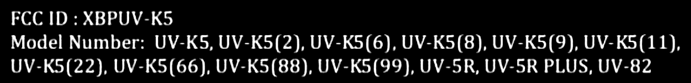
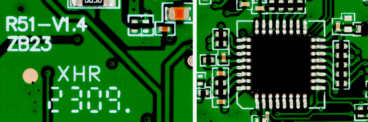

## Quansheng UV-K5/K6/5R v2.1.27 firmware

**Open Source re-implementation**

The root README.md has been moved in docs/ folder, here:

* [docs/README.md](docs/README.md)

This home page is dedicated to the fork and its development.

 

## UV-K5 hardware

Quansheng UV-K5 is a name and a shell that contains an electronic PCB which is the same among various models (cfr. [here](docs/UV-K5.pdf)) included the UV-5R but compated with this, the UV-K5 can be modded also in terms of firmware. 

It microprocessor is an ARM Cortex M0 and in particular it is a STM32G030x8 which works at 64MHz and it is packaged with 32-pinout case. This chip contains 64Bb of program memory space (internal flash) and 8Kb of RAM. Plus a 64Kb EEPROM which is external to the uP chip. While the RF chip is a BK4819.

Hence, it allows 60Kb firmware files reasonably because the first 4Kb are used for the bootloader which also deliver the firmware update from the serial port embedded into the hearphone/mic jacks.

The BK4819 is a half duplex TDD FM transceiver operating within 18 MHz ~ 660, MHz, 840 MHz ~1300 MHz band range. Besides speech communication, the BK4819 on-chip FSK data modem supports F2D and F1W emission to be used in both FRS and DPMR band for text message and GPS information exchange. 

The following branded STM32G031, STM32G041 Cortex G-series are two models providing the electrical pinout compatible with the STM32G030x8. Moreover, a quick investigation these two model are provided with a RAM that can vary between 8Kb upto 64Kb.

- The STM32G031 is similar to the STM32G030, but with some additional features such as ADC peripheral enhancements and power management functions.

- Compatible in terms of pinout with STM32G031, with hardware security function that can support encryption.

At this time, the compatibility with other uP chips is under investigation. The final word can be a chip upgrade that works.

 

## Fork status

This repository contains **UNTESTED** code on two serving branches:

- **main**: cherry picking from devel, it compiles but it is untested

- **devel**: seeking for insparation, might not even compile (WARNING)

I have managed to fill the flash at 99.96% and to reduce the size of it, enough to start being interesting.

There is still space for improvements but the mass of untested code is skyrocketing and going to be overwhelming for almost everyone else who wishes leverage it.

Time to share this challenge with other people and spawning more branches like stable, testing, etc. with two small commits to test per week? Wanna join?

I have a **JucJet UV-K5**, it works well with `CHIRP`, `CSP` and [k5prog](https://github.com/robang74/k5prog) but not tried to flash it, yet

Those are interested in this development, please drop an e-mail `roberto.foglietta@gmail.com` 

or get in touch by the Zello channel `UV-K5-mods` - [zello.com/uv-k5-mods](https://zello.com/uv-k5-mods)

<!-- img src="https://zello.com/channels/qr?name=UV-K5-mods" alt="zello.com/uv-k5-mods" style="float:center; width:145px; heigth:145px;"/-->

## Fork scope

This github repository and related ativities are part of a broader project named **Guy Fawkes Starting Pack** started with a [LinkedIn article](https://www.linkedin.com/pulse/guy-fawkes-starting-pack-roberto-a-foglietta-jm9kf) on 15th January 2023 and continously updated after its 1st draft pubblication. It consultation is public but because LinkedIn is a proprietary medium platform that usually prevents people printing their own PDF copy of the article, then it is also available in [PDF](https://drive.google.com/file/d/1DveGE1CbTdQ8xOOhGyEOS_hilnxMM_XK/view) format by a Google Driver link.

## Fork goals

Which is the reason for this fork from the well-known **armel** repo?

1. I do things for me myself and in doing that I am using cloud-based tools

2. which are giving more free-of-charge resources to people who share their work.

3. sharing information is a well-assessed attitude rooted in my 20 year-long private teacher experience

4. and it fits with my idea that Open Source and Bazaar principles are sounding valid,

5. plus I felt that Mr. Armel is more interested in donations and its own business,

6. rather than collecting, organizing and integrating attributes for UV-K5 firmware.

I wish to be clear about the last two points: nothing personal and everyone does what s/he wants. In fact, here I am, forking a githup repo and carrying on my way.

In case you wish to contribute with a commit or a technical information or an insightful grasp or with fixing or highlighting a shortcoming or a constructive critic, you are welcome whoever you are or doing in your own life.

## On my own way

For everybody else, silence is gold plus quick middle fingering is my way to go (cfr. the [bullsh*t asymmetry principle](https://statmodeling.stat.columbia.edu/2019/01/28/bullshit-asymmetry-principle/)) and you are invited to do something the same: take *the bright side of the life* (cit.), and skip the rest.

> I don't have a short temper, I just have a quick reaction to bullshit -- Elizabeth Taylor

Audrey Hepburn in the picture, not Elizabeth Taylor, Ada Lovelace, Hedwig Eva Maria Kiesler (aka Hedy Lamarr) or any other lovely nerdishly Morticia Addams. LOL

Hackers, we will never ask for your permission to do things that we know or learning how to do. Keep it stick in the mind and write it down in a post-it and attach to your PC screen nearby the one you are using for your login password.

## Links

* [UV-K5 Wiki (repo)](https://github.com/ludwich66/Quansheng_UV-K5_Wiki)

* [UV-K5 Wiki (home)](https://github.com/ludwich66/Quansheng_UV-K5_Wiki/wiki)

* [amnemonic (tools)](https://github.com/amnemonic/Quansheng_UV-K5_Firmware)

* [losehu (mod)](https://github.com/losehu/uv-k5-firmware-custom)

* [fagci reborn (FW)](https://github.com/fagci/uvk5-fagci-reborn)

* [fagci modder (tool)](https://github.com/fagci/qs-uvk5-firmware-modder)

* [selevo WebUSBserial (tool)](https://github.com/selevo/WebUsbSerialTerminal)

* [piotr022 playground (mesg)](https://github.com/piotr022/UV_K5_playground)

* [tunas1337 18-to-1300 (fork)](https://github.com/fagci/UV-K5-Modded-Firmwares)

